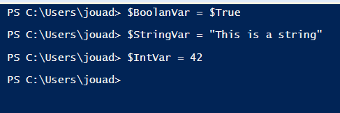

# Variables-and-Operators-Tasks

Homework on variables and operators with Windows PowerShell ISE.

## Task 1
Assign a variable with each datatypes covered in the previous workshop.

The datatypes previous covered were “Boolean”, “String”, “Int”

## Task 2
List all variables currently loaded in to memory.
The noun within the cmdlet is “Variable”.

## Task 3

Multiple two Int variables together
PowerShell can perform basic maths operators, such as “+”, “-“ and “*”.

## Task 4

First declare two Int variables. Then divided the first variable by the second and assign the result to a variable named $VariableResult.

The easiest way to do this is within the Integrated Scripting Environment
(ISE) using multiple lines of code.

## Task 5

Typecast a Variable as a “String” and assign it a value of 5.

Remember to normal brackets [] rather than curly brackets {} when typecasting a variable.

